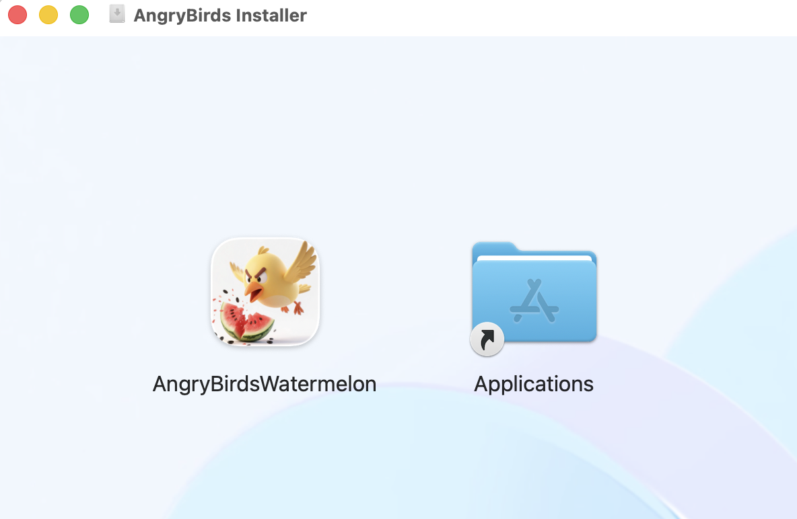
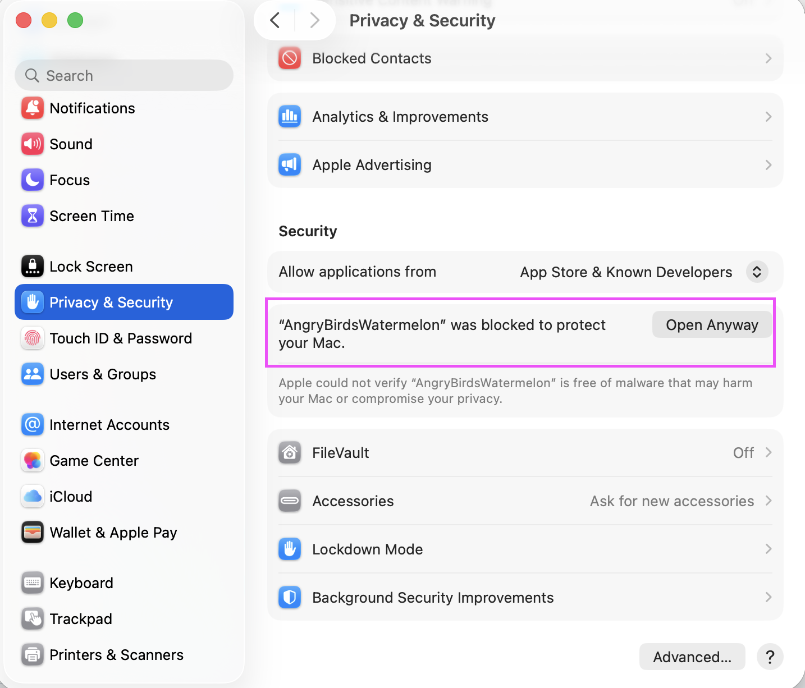
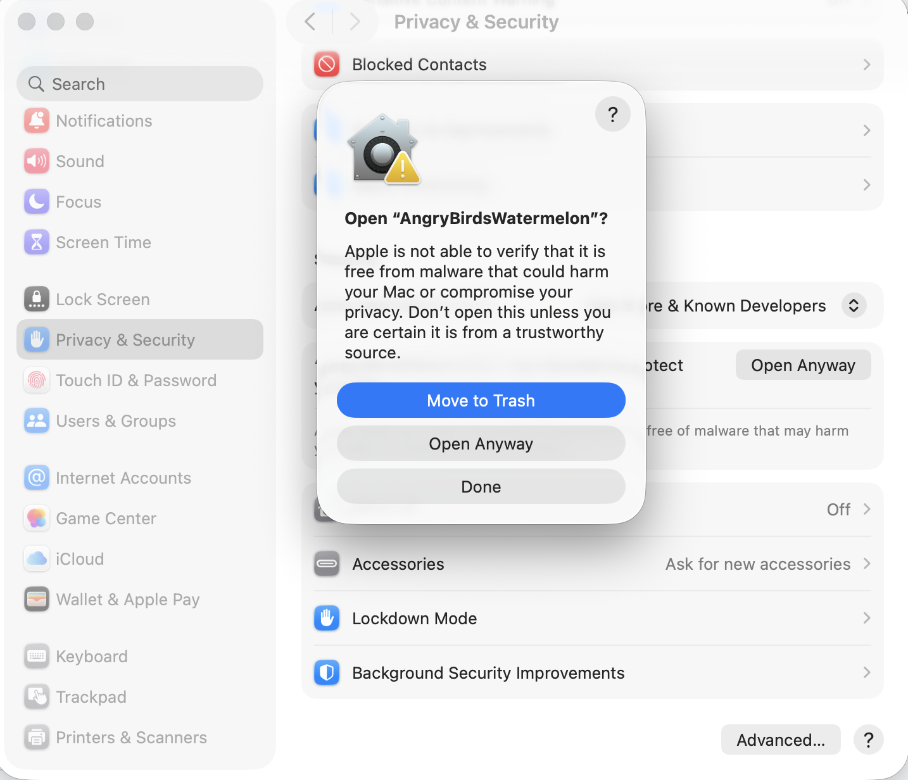
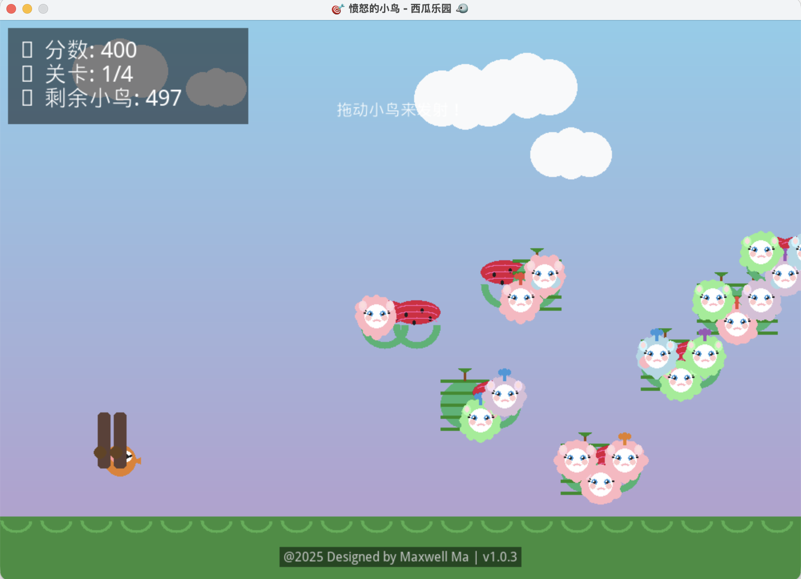

# angry_birds_watermelon

  In this demo, I will write angry_bird game using Python + Pygame + PyInstaller and will also create .dmg file and releases for Mac Os users download to install 

## Usage
- Prepare python virtural environment if you want to run locally with source code 
```shell
python3 -m venv venv
```
- Activate virtural environment
```shell
source venv/bin/activate
```
- Install requirements.txt
```shell
pip install -r requirements.txt
```
- Run the game
```shell
python3 main.py
```

- Download the dmg ad install angry-birds on your Mac OS 

- drag the app to your Applications



- open system settings and go to privacy & security



- allow open anyway



- Now you can begin to play the angry birds games




## Control Reference

- **R** -- Reset the position of the bird
- **T** -- Predict the track of the bird
- **M** -- Turn off/on the music
- **N** -- Go to the next level


